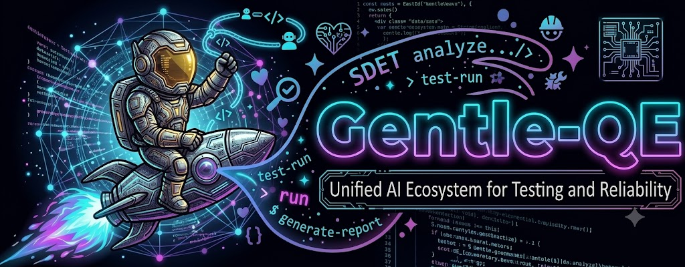

<div align="center">



<h1>Gentle-QE</h1>

<p><strong>Gentle-QE — Unified AI Ecosystem for Testing and Reliability.</strong></p>

<p>El ecosistema, frameworks y workflows de <a href="https://github.com/Gentleman-Programming/gentle-ai">Gentle-AI</a>, reorientado a <strong>QE / SDET</strong>: pensar como QA Senior (ISTQB, shift-left) con skills y agentes de testing listos para usar.</p>

<p>
<a href="https://github.com/EduardoVeraE/gentle-qe/releases"></a>
<a href="LICENSE"></a>


</p>

</div>

---

## What It Does

**Gentle-QE is a QE/SDET-focused distribution built on top of [Gentle-AI](https://github.com/Gentleman-Programming/gentle-ai).** It inherits the *entire* Gentle-AI ecosystem — persistent memory, Spec-Driven Development workflows, curated coding skills, MCP servers, an AI provider switcher, per-phase model assignment, and support for 15+ AI coding agents — and adds a **testing-first overlay** on top:

- **SDET persona** (ISTQB, shift-left, risk-based) instead of the generic teaching persona.
- **QE skills** the upstream doesn't ship: manual testing (ISTQB), security/OWASP, API & contract testing, Playwright E2E, accessibility, k6 load testing, and Selenium (Java).
- **QE presets** that wire those skills into ready-made stacks: `qe-front`, `qe-api`, `qe-perf`, and `qe-sdet` (the full SDET stack — the default).

**Before**: "My agent writes code, but nobody's thinking about how it breaks."

**After**: Your agent thinks like a Senior QA/SDET — shift-left, risk-based, with testing skills, security checks, and reliability workflows baked in.

> **Built on Gentle-AI.** Every harness, framework and improvement of the upstream ecosystem is preserved and kept in sync. Gentle-QE is an additive overlay, not a rewrite — full credit to [Gentleman-Programming/gentle-ai](https://github.com/Gentleman-Programming/gentle-ai) for the foundation.

### The QE Overlay at a glance

| Preset       | Stack                                                            |
| ------------ | --------------------------------------------------------------- |
| **qe-sdet**  | Full SDET stack: all QE skills + SDET persona (**default**)     |
| **qe-front** | E2E frontend: Playwright BDD + accessibility                    |
| **qe-api**   | API / contract testing                                          |
| **qe-perf**  | Performance: k6 load/stress/soak                                |

| QE Skill              | Focus                                                          |
| --------------------- | ------------------------------------------------------------- |
| `qa-manual-istqb`     | Manual testing, ISTQB references & templates                  |
| `qa-owasp-security`   | Pentest / OWASP: attack scripts, threat models, vuln reports  |
| `api-testing`         | API & contract testing                                        |
| `playwright-e2e-testing` | E2E with Playwright (BDD)                                   |
| `a11y-playwright-testing` | Accessibility testing with Playwright                     |
| `k6-load-test`        | Performance testing with k6                                   |
| `selenium-e2e-java`   | E2E with Selenium WebDriver (Java)                            |

### Inherited from Gentle-AI

Gentle-QE supports the same 15+ agents and ecosystem features as upstream — Claude Code, OpenCode, Cursor, Gemini CLI, VS Code Copilot, Codex, Windsurf, Pi, and more — with full delegation models, SDD workflows, Engram persistent memory, and per-phase model routing. See the [Documentation](#documentation) section; those guides describe the shared foundation.

---

## Quick Start

### macOS / Linux

```bash
curl -fsSL https://raw.githubusercontent.com/EduardoVeraE/gentle-qe/main/scripts/install.sh | bash
```

### Windows

```powershell
scoop bucket add eduardovera https://github.com/EduardoVeraE/scoop-bucket
scoop install gentle-qe
```

### After install: project-level setup

Once your agents are configured, open your AI agent in a project and run these to register the project context:

| Command                            | What it does                                                                | When to re-run                                                                 |
| ---------------------------------- | --------------------------------------------------------------------------- | ------------------------------------------------------------------------------ |
| `/sdd-init`                        | Detects stack, testing capabilities, activates Strict TDD Mode if available | When your project adds/removes test frameworks, or first time in a new project |
| `gentle-qe skill-registry refresh` | Scans installed skills and project conventions, builds the registry         | After installing/removing skills, or first time in a new project               |

These are **not required** for basic usage. The SDD orchestrator runs `/sdd-init` automatically if it detects no context.

Run `gentle-qe doctor` at any time for a read-only health check of your ecosystem (tool binaries, `state.json`, Engram reachability, disk space).

---

## Install

### Recommended

```bash
# macOS / Linux
brew tap EduardoVeraE/homebrew-tap
brew install --cask eduardovera/homebrew-tap/gentle-qe

# Windows
scoop bucket add eduardovera https://github.com/EduardoVeraE/scoop-bucket
scoop install gentle-qe
```

<details>
<summary><strong>Build from source</strong> (any platform with Go 1.24+)</summary>

```bash
git clone https://github.com/EduardoVeraE/gentle-qe.git
cd gentle-qe
go build -o gentle-qe ./cmd/gentle-ai   # the Go module path stays upstream by design
```

> The Go **module path is intentionally kept** as `github.com/gentleman-programming/gentle-ai` so upstream merges stay conflict-free. Only the product/brand (`gentle-qe`), releases and self-update point to this fork.

</details>

By default, `gentle-qe install` writes agent-scoped files to each selected agent's global config directory. To keep the stack isolated to one project, run:

```bash
gentle-qe install --scope=workspace
```

---

## Backups

Every install, sync, and upgrade automatically snapshots your config files. Backups are **compressed** (tar.gz), **deduplicated**, and **auto-pruned** (keeps the 5 most recent). Pin important backups via the TUI (`p` key) to protect them from pruning.

See [Backup & Rollback Guide](docs/rollback.md) for details.

---

## Key Features You Should Know About

### Engram (Persistent Memory)

Your AI agent automatically remembers decisions, bugs, and context across sessions:

```bash
engram projects list          # See all projects with memory counts
engram search "auth bug"      # Find a past decision from the terminal
engram tui                    # Visual memory browser
```

**Full reference**: [Engram Commands](docs/engram.md)

### OpenCode SDD Profiles

Assign different AI models to different SDD phases — a powerful model for design, a fast one for implementation, a cheap one for exploration.

```bash
gentle-qe sync --profile cheap:openrouter/qwen/qwen3-30b-a3b:free
gentle-qe sync --profile-phase cheap:sdd-design:anthropic/claude-sonnet-4-20250514
```

**Full guide**: [OpenCode SDD Profiles](docs/opencode-profiles.md)

---

## Documentation

These guides describe the shared Gentle-AI foundation that Gentle-QE builds on:

| Topic                                              | Description                                                                             |
| -------------------------------------------------- | --------------------------------------------------------------------------------------- |
| [Intended Usage](docs/intended-usage.md)           | The mental model behind the ecosystem                                                   |
| [OpenCode SDD Profiles](docs/opencode-profiles.md) | Create and manage per-phase model profiles for OpenCode                                 |
| [Engram Commands](docs/engram.md)                  | CLI commands, MCP tools, project management, team sharing                               |
| [Agents](docs/agents.md)                           | Supported agents, feature matrix, config paths, and per-agent notes                     |
| [Skill Registry](docs/skill-registry.md)           | Index-first skill discovery flow, delegation contract, and usage diagrams              |
| [Components, Skills & Presets](docs/components.md)  | All components, behavior, skill catalog, and preset definitions                         |
| [Usage](docs/usage.md)                             | Persona modes, interactive TUI, CLI flags, and dependency management                    |
| [Backup & Rollback](docs/rollback.md)              | Backup retention, compression, dedup, pinning, and restore                              |
| [Platforms](docs/platforms.md)                     | Supported platforms, Windows notes, security verification, config paths                 |

---

## Credits & Upstream

Gentle-QE is a fork of **[Gentleman-Programming/gentle-ai](https://github.com/Gentleman-Programming/gentle-ai)** and tracks it continuously. All the ecosystem foundations — memory, SDD, skills, MCP, persona, multi-agent support and every harness — are the work of the Gentle-AI community.

<a href="https://github.com/Gentleman-Programming/gentle-ai/graphs/contributors">
  
</a>

The QE/SDET overlay (testing skills, SDET persona, QE presets) is maintained by [@EduardoVeraE](https://github.com/EduardoVeraE).

---

<div align="center">

<br/>
<a href="LICENSE"></a>
</div>
